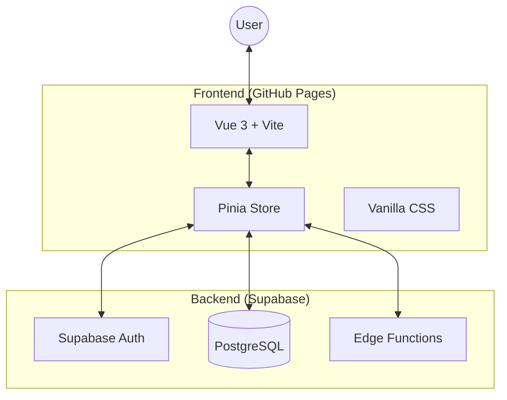

<p align="center">
  
  
  
</p>

<h1 align="center">✦ Aether Productivity Hub</h1>

<p align="center">
  <em>A high-performance, cloud-synced productivity engine built with Vue 3 and Cloudflare Edge.</em><br/>
  <em>Designed for privacy, speed, and deep work. No trackers. No fluff.</em>
</p>

---

Aether is a unified productivity dashboard that consolidates task management, portfolio tracking, and focus analytics into a single, glassmorphism-inspired interface. Built with precision and privacy, it leverages Supabase for real-time data persistence and is hosted entirely on GitHub Pages.

## 🏗️ Architecture



## ✨ Core Pillars

### 📋 Routines (Tasks & Habits)
- **Unified Flow**: Manage one-off tasks and recurring daily rituals in a single view.
- **Priority Matrix**: Visual indicators for 🔴 High, 🟡 Medium, and 🟢 Low impact work.
- **Cloud Sync**: Real-time synchronization across all devices via Supabase.

### 💰 Portfolio (Investment Tracker)
- **Real-Time Quotes**: Live market data integrated via Finnhub.
- **Visual Analytics**: Interactive area charts powered by **Chart.js**.
- **Privacy First**: API keys and personal data are secured via Supabase Row Level Security (RLS).

### 📅 Chronos (Calendar Integration)
- **Unified Schedule**: Manage local events and import external schedules.
- **.ics Support**: Lightweight parser to import Google Calendar or Outlook events directly.
- **Visual Heatmap**: Quick overview of your upcoming week at a glance.

### ⏱️ Deep Work (Focus Timer)
- **Pomodoro Engine**: Customizable focus and rest cycles.
- **Focus Analytics**: Automatically logs sessions to track your "Flow" over time in various modes.
- **Circular Progress**: Sleek SVG-based timer widget on the dashboard.

## 🛠️ Tech Stack

- **Frontend**: Vue 3 (Composition API) + Vite + Pinia
- **Database/Auth**: Supabase (PostgreSQL + RLS)
- **Deployment**: GitHub Pages (Automated via GitHub Actions)
- **Styling**: Pure Vanilla CSS + Glassmorphism components
- **Charting**: Chart.js 4

## 🚀 Getting Started

### Local Setup
```bash
# Clone the repository
git clone https://github.com/OldNero/Aether-Productivity-Hub.git
cd Aether-Productivity-Hub

# Install dependencies
npm install

# Create environment file and add your Supabase credentials
cp .env.example .env

# Start development server
npm run dev
```

> [!IMPORTANT]
> **API Key Required**: To enable market data, you must provide your own API key for Finnhub in the **Settings** page within the app.

## ⚖️ License & Privacy

This project is licensed under the **PolyForm Noncommercial License 1.0.0**. It is free for personal use but requires consent for commercial monetization. 

Aether is built with privacy as a core principle. Your data stays in your dedicated Supabase instance, protected by standard security protocols.

---

<p align="center">
  Built with ☕ and curiosity by <a href="https://github.com/OldNero">@OldNero</a>
</p>
